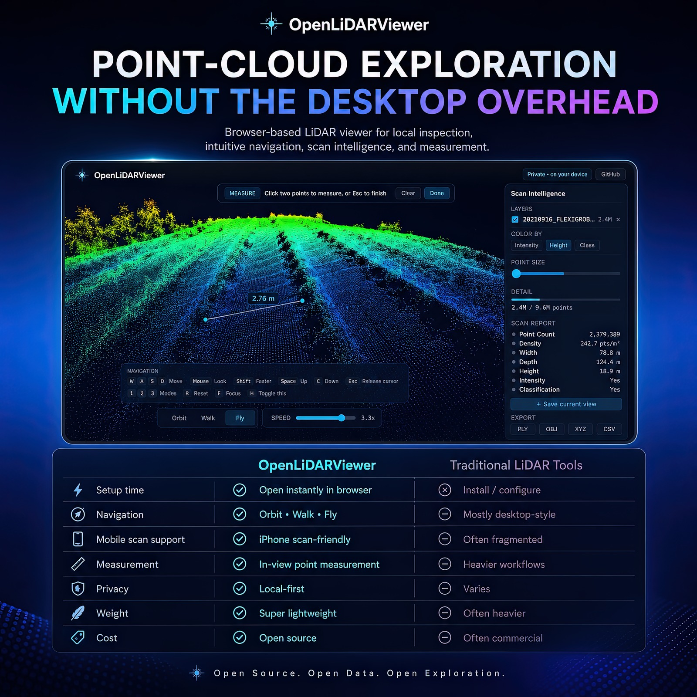
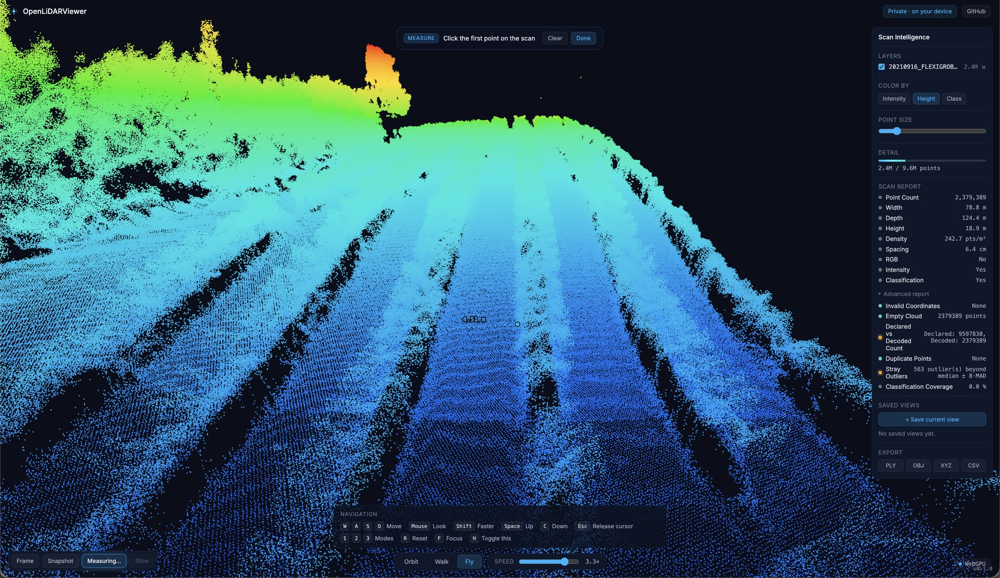
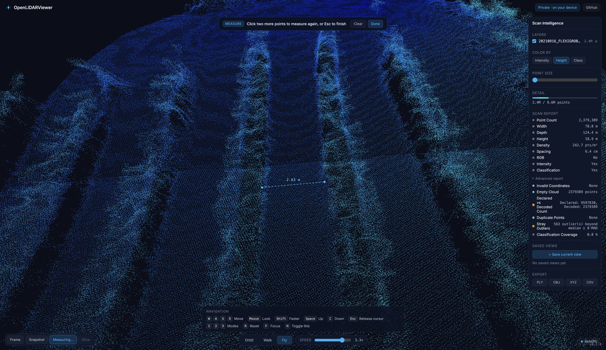
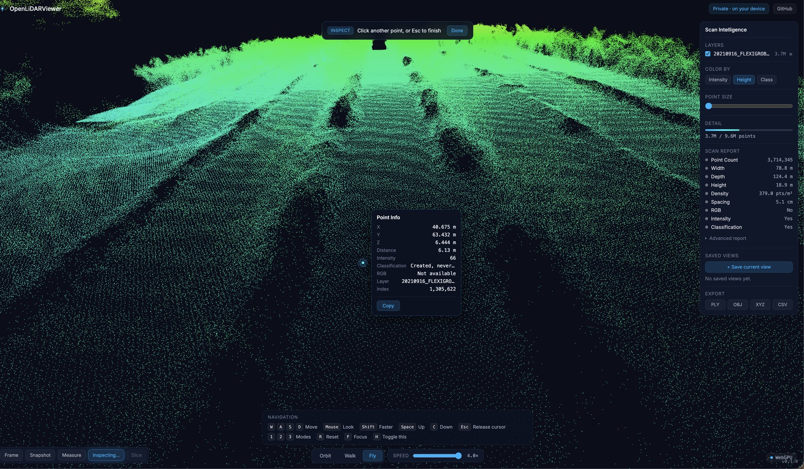
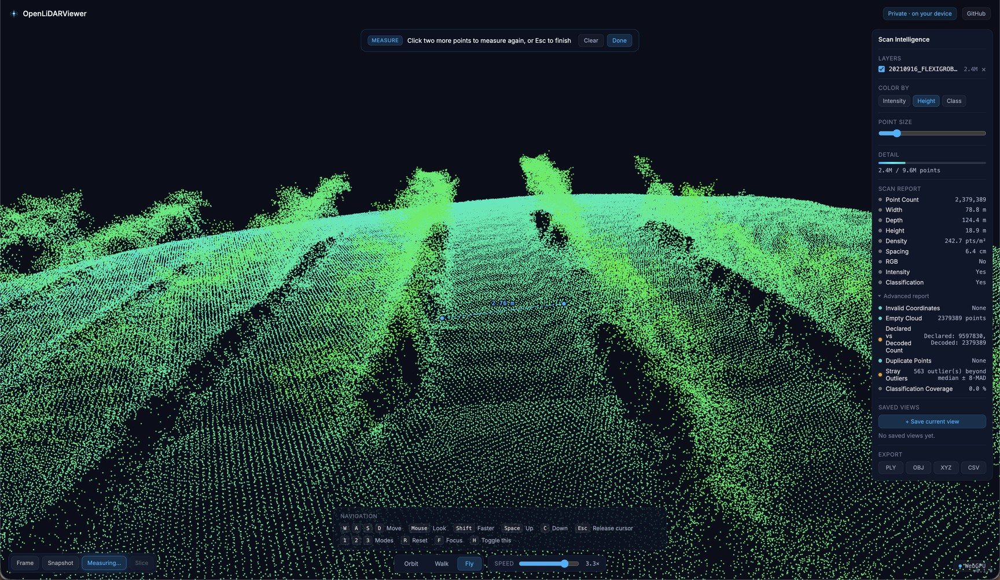

# OpenLiDARViewer




**A lightweight, browser-based LiDAR and point-cloud viewer for fast local inspection, 3D navigation, measurement, and scan intelligence.**

**Live version: [https://lidar.aurtech.mx/](https://lidar.aurtech.mx/)**

---

## Overview

OpenLiDARViewer opens LiDAR and point-cloud datasets straight in the browser. You can inspect a scan, navigate it in 3D, switch how it is colored, measure distances, and export results, without setting up a desktop GIS workflow.

The idea is simple: opening a point cloud should feel about as easy as opening an image, but you still get the spatial depth, navigation, and inspection tools that real LiDAR work needs.

It is built as an R&D project for browser-native geospatial visualization and human-centered point-cloud interaction. It is not a GIS, photogrammetry, or survey-grade processing suite. It is a fast, focused viewer.

## Live Demo

A live version is available at **[https://lidar.aurtech.mx/](https://lidar.aurtech.mx/)**.

Performance there depends on your browser, GPU, memory, the dataset size, and the rendering detail you pick.

## Why OpenLiDARViewer?

Most LiDAR tools are powerful, but a lot of them are heavy, desktop-first, and GIS-shaped. That is a poor fit when you just need to open a scan, look at it, move around, measure something, and show it to someone.

OpenLiDARViewer takes a lighter path. It runs in the browser with nothing to install. Files are read and rendered locally, so there is no server to upload to. It keeps the interface small and the navigation game-like instead of GIS-like. And it is built to be a testbed for browser-native spatial computing rather than a full GIS replacement.

It opens georeferenced drone LiDAR surveys in LAS and LAZ, terrestrial laser-scanner data in E57 — including exports from Trimble and other survey scanners — and compatible iPhone and mobile scan exports (PLY, OBJ, GLB/GLTF). More professional point-cloud formats are on the roadmap as the pipeline matures.

## Key Advantages

- Inspect point-cloud datasets directly in a modern web interface, with nothing to install.
- Local-first by design: files are read and rendered in your browser, with no upload, which suits sensitive survey data.
- Opens compatible iPhone and mobile scan exports when saved as PLY, OBJ, GLB/GLTF, XYZ, or CSV.
- Opens georeferenced drone LiDAR surveys in LAS and LAZ, and terrestrial laser-scanner data in E57, with a coordinate bridge that keeps large survey coordinates precise.
- Game-like navigation: Orbit, Walk, and Fly modes with WASD and mouse-look.
- A small, focused interface that stays out of the way and keeps you on the scan.
- A full measurement toolkit — distance, polyline, area, height, angle, and slope — with editable points, in-session persistence, and JSON export/import.
- Inspect any point: click it to read its exact coordinates, intensity, classification, and colour, then copy them in one click.
- A Scan Intelligence panel that reports point count, dimensions, density, spacing, and detected attributes.
- Color by height, intensity, classification, stored RGB, or surface normal direction.
- Save camera viewpoints and return to them for inspection, reports, and presentations.
- Save PNG snapshots, or re-export the cloud as PLY, OBJ, XYZ, or CSV.
- A clean dark interface aimed at researchers, developers, and geospatial work.

OpenLiDARViewer does not claim survey-grade measurement or support for every LiDAR format. Capabilities are described honestly. See [Current Limitations](#current-limitations) and the [Roadmap](#roadmap).

## Features

- Browser-based point-cloud visualization
- Local-first scan inspection: nothing is uploaded
- WebGPU rendering with an automatic, fully tested WebGL 2 fallback
- Eye Dome Lighting depth shading that makes point-cloud structure far more readable, with a strength control
- Import: LAS, LAZ, E57, PLY, OBJ, GLB, GLTF, XYZ, CSV
- Export: PLY, OBJ, XYZ, CSV, and PNG snapshots
- Height, intensity, classification, RGB, and surface-normal color modes, picked automatically per file
- Adaptive or fixed point sizing, round antialiased points, and a Detail control that shows an honest `shown / total` count
- Orbit, Walk, and Fly navigation with WASD movement and mouse-look
- A measurement toolkit with six tools — distance, polyline, area, height, angle, and slope — with draggable points, undo, rename, a units toggle, and JSON session export/import
- Open multiple scans as layers, or close the current scan from the tool dock to start fresh with another
- Point inspection — click a point to read its coordinates and attributes, with one-click copy to the clipboard
- A Scan Intelligence panel with point count, dimensions, density, spacing, attributes, and an Advanced report of integrity diagnostics
- Capture provenance from LAS/LAZ and E57 headers — sensor, source software, and date — shown in the Scan Report when the file carries them
- A "Project ready" summary card on load, with a suggested navigation mode
- Saved camera views for repeatable inspection
- A coordinate bridge that keeps large georeferenced (UTM-scale) coordinates precise
- An embed mode for `<iframe>` use (`?embed=1`)

## Screenshots

| | |
|---|---|
|  |  |
| A 9.6M-point drone survey, height-colored, with the Scan Intelligence panel and the Orbit / Walk / Fly navigation. | The measurement toolkit — here a distance between two picked points; it also measures polyline, area, height, angle, and slope. |
|  |  |
| Inspecting a point: a glowing marker and a card with its real-world coordinates and attributes. | The Scan Intelligence panel — point count, dimensions, density, spacing, attributes, and the Advanced report. |

More in [`docs/screenshots.md`](docs/screenshots.md).

## Navigation

OpenLiDARViewer has a game-like navigation system, so a scan can be explored like a 3D environment.

| Control | Action |
|---|---|
| W / A / S / D | Move through the scan |
| Mouse | Look around (click the scan to capture the cursor) |
| Shift | Move faster |
| Space | Move up |
| C / Ctrl | Move down |
| Esc | Release the cursor |
| R | Reset / re-frame the view |
| F | Focus on the point under the cursor |
| 1 / 2 / 3 | Orbit / Walk / Fly mode |
| Double-click | Fly to the clicked point |

Orbit mode is best for inspecting an object or area from the outside. Walk mode suits interiors, buildings, corridors, and street-level scans. Fly mode is for drone LiDAR, terrain, forests, and wide-area scans.

Movement speed scales with the size of the loaded scan, so the controls feel right whether the dataset is a small room or a kilometre-wide survey. Full detail is in [`docs/navigation.md`](docs/navigation.md).

## Rendering

OpenLiDARViewer is tuned so a point cloud reads as a 3D surface, not a flat wash of dots.

**Eye Dome Lighting** adds screen-space depth shading: it darkens every depth discontinuity, so edges, ridges, and the separation between near and far structure all become legible. It runs as a post-processing pass that targets both the WebGPU and WebGL 2 backends from one node graph. It is on by default on desktop WebGPU, and off by default on the WebGL 2 fallback and on mobile, where it can still be switched on.

**Adaptive point sizing** scales points with camera distance — clamped so far points stay visible and near points do not bloat — so density reads correctly across a scan. A Fixed mode keeps a constant on-screen size.

Points render as round, soft-edged dots with point-edge antialiasing, so overlapping points blend cleanly instead of stacking into visual noise.

All of this is tunable from the Rendering section of the Scan Intelligence panel: the Eye Dome Lighting toggle and strength, the Adaptive / Fixed point-size switch, and the antialiasing toggle.

## Measurement

OpenLiDARViewer includes a measurement toolkit for visual inspection and documentation. Open the Measure tool, pick a kind from the toolbar, and place points directly on the scan. Six tools are available:

| Tool | What it measures |
|---|---|
| Distance | Straight-line distance between two points |
| Polyline | Total length of a multi-segment path |
| Area | Polygon area — both the true area in the polygon's own plane and the horizontal (map-projected) area |
| Height | Vertical difference between two points |
| Angle | The angle at a vertex between two arms |
| Slope | Rise, run, slope angle, and grade percentage between two points |

Every measurement is editable: drag a point to move it, undo the last point while placing, rename a measurement, or clear them all. Placed measurements are listed in a compact Measurements panel and persist for the session. A single toggle switches all readouts between metric and imperial units. The whole set can be exported to a JSON session file and re-imported later.

Measurement is meant for visual inspection and research, not survey-grade use. Treat it as survey-grade only if you have validated it against survey-grade data and procedures.

## Supported / Target Formats

**Current import formats:** `LAS`, `LAZ`, `E57`, `PLY`, `OBJ`, `GLB`, `GLTF`, `XYZ`, `CSV`.

**Current export targets:** `PLY`, `OBJ`, `XYZ`, `CSV`, and `PNG` snapshots.

**iPhone and mobile scans.** OpenLiDARViewer opens exports from iPhone LiDAR and mobile scanning apps when they are saved as a supported format, usually PLY, OBJ, or GLB/GLTF (and XYZ/CSV). `USDZ` exports need conversion to a supported format first.

**Terrestrial laser scanners.** `E57` (ASTM E2807), the standard exchange format for terrestrial laser scanners, is read directly in the browser. The parser handles Cartesian coordinates, RGB colour, intensity, classification, surface normals, scan poses, and multi-scan files (every scan is merged into one cloud). E57 exports from Trimble survey scanners have been tested, and other standard E57 files — Leica, FARO, Matterport, and similar — follow the same ASTM format.

**Drone LiDAR and professional point clouds.** Georeferenced drone LiDAR surveys in LAS and LAZ work today. Planned support includes `PCD`, `PTS/PTX`, and cloud-optimised or streaming formats such as `COPC LAZ` and `3D Tiles / PNTS`.

Format support varies with browser memory, GPU capacity, dataset size, preprocessing, and implementation status. Full detail is in [`docs/supported-formats.md`](docs/supported-formats.md).

## System Requirements

OpenLiDARViewer runs in the browser and depends on modern GPU-accelerated web rendering. Performance varies with the dataset and the device.

Use a modern Chromium-based browser (Chrome or Edge) with WebGL 2.0 support and hardware acceleration enabled. WebGPU is used automatically where it is available.

| Component | Minimum | Recommended |
|---|---|---|
| CPU | Modern dual-core | Quad-core or better |
| RAM | 8 GB | 16 GB or more |
| GPU | Integrated GPU with WebGL 2.0 | Dedicated GPU, or modern Apple Silicon / integrated GPU |
| Browser | WebGL 2.0 compatible | WebGL 2.0 and WebGPU-capable |

Very large LiDAR datasets may need downsampling, preprocessing, or future streaming formats. Full detail is in [`docs/performance.md`](docs/performance.md).

## Mobile Browser Support

OpenLiDARViewer includes a mobile-friendly interface for opening compatible point-cloud and 3D scan files from phones and tablets.

On mobile:

- Files can be opened from the device file picker.
- Users can open compatible exports saved to device storage or cloud file providers.
- Scan Intelligence is shown as a compact panel after loading a scan.
- Navigation uses touch gestures instead of keyboard shortcuts.
- Measurement uses tap-based point selection.
- Rendering defaults to a mobile-safe performance mode.

Recommended mobile workflow:

1. Export a compatible scan from a mobile scanning app.
2. Save it to device storage or a cloud file provider such as iCloud Drive.
3. Open OpenLiDARViewer in a mobile browser.
4. Tap "Open scan from device."
5. Inspect, measure, and export.

Mobile scanning app note: OpenLiDARViewer can open compatible files exported from mobile scanning apps when the exported format is supported by the viewer. A practical testing workflow is to capture a scan with an iPhone LiDAR scanning app — such as Polycam, Scaniverse, or 3D Scanner App — export it in a supported format (GLTF/GLB, OBJ, or PLY), save the file to the device, and open it in OpenLiDARViewer. Available export formats, free-tier options, and pricing differ between apps and can change over time, so check each app's current help documentation. Some formats may require a paid plan.

Mobile performance note: Mobile performance depends on browser, GPU, memory, file size, and point count. Very large datasets may require desktop hardware, downsampling, tiling, or optimized formats.

Trademark note: All third-party product names are used only for descriptive compatibility and workflow documentation. OpenLiDARViewer is not affiliated with, endorsed by, or sponsored by Apple, Polycam, or other third-party scanning apps.

Full detail is in [`docs/mobile-browser-support.md`](docs/mobile-browser-support.md).

## Research & Development Focus

OpenLiDARViewer started as an experiment: how far can modern browser technology go in making LiDAR and point-cloud data easy to reach? It looks at browser-native point-cloud rendering, lightweight WebGL/WebGPU pipelines, human-centered interaction with 3D data, game-inspired navigation for technical inspection, local-first workflows for sensitive data, and simpler interfaces for complex datasets.

The aim is not to replace full GIS or survey-grade processing. It is to give people a fast, approachable way to open, inspect, navigate, measure, and present point clouds. See [`docs/research-notes.md`](docs/research-notes.md).

## How It Works

1. You load a point-cloud dataset by dropping a file, or by clicking a built-in sample.
2. The format is detected from the file's magic bytes first, then its extension.
3. The file is parsed off the main thread, inside a Web Worker.
4. Point positions and attributes are decoded. Large georeferenced coordinates are recentered in double precision before the float32 downcast.
5. Clouds above the point budget are voxel-downsampled, and the Detail control shows the honest `shown / total` count.
6. The cloud renders through a WebGPU or WebGL 2 pipeline built on three.js; Eye Dome Lighting adds screen-space depth shading as a post-processing pass.
7. Color modes map height, intensity, classification, RGB, or surface-normal direction onto the points, which are sized adaptively with distance.
8. You explore with Orbit, Walk, or Fly navigation.
9. Scan Intelligence summarizes the dataset, and the measurement toolkit takes distance, area, height, angle, and slope measurements.
10. You save viewpoints and export snapshots, re-exported point data, or a JSON measurement session.

## Technology Stack

- TypeScript, in strict mode, across the IO, model, and render layers
- three.js (`three/webgpu`), a WebGPU renderer with a WebGL 2 fallback
- A `three/tsl` node-graph post-processing pipeline (Eye Dome Lighting) that targets both backends from one shader description
- loaders.gl and laz-perf (WASM) for mesh and LAZ parsing, plus a from-scratch TypeScript E57 parser
- Vite for the build and dev server, with Web Worker and WASM handling
- Vitest and Playwright for unit and end-to-end tests
- A client-side, local-first pipeline with no backend

## Getting Started

```bash
git clone https://github.com/aurtechmx/openlidarviewer.git
cd openlidarviewer
npm install
npm run dev
```

Open the local URL it prints, then drop a scan onto the page or click a built-in sample.

To build for static hosting (GitHub Pages, Netlify, or any CDN, since it is just files):

```bash
npm run build
npm run preview
```

## Usage

1. Open the app in a modern WebGL/WebGPU-capable browser.
2. Drop a compatible point-cloud file onto the page.
3. Choose a visual mode: Height, Intensity, Classification, RGB, or Normal.
4. Adjust point size and rendering detail.
5. Navigate with Orbit, Walk, or Fly mode.
6. Read the Scan Intelligence panel for dataset metadata and quality.
7. Measure distance, polyline, area, height, angle, or slope inside the point cloud.
8. Save viewpoints for repeated inspection.
9. Export a PNG snapshot, re-export the cloud as PLY, OBJ, XYZ, or CSV, or save a JSON measurement session.
10. Close the scan from the tool dock to return to the start and open another.

A fuller walkthrough is in [`docs/usage.md`](docs/usage.md).

## Architecture Overview

OpenLiDARViewer is deliberately modular, with one file per format and one file per concern. File loading, point parsing, the coordinate bridge, render-buffer generation, color modes, the navigation manager, the measurement system, the Scan Intelligence modules, and the export system are all separable. See [`docs/architecture.md`](docs/architecture.md) and the [Developer Manual](docs/developer-manual.md).

## Performance Notes

Performance depends on point count, browser memory, GPU capability, point size, rendering detail, the color mode in use, the file format, and how the data was prepared. Clouds above a roughly 4M-point budget are voxel-downsampled to stay responsive, and the Detail readout always shows the honest `shown / total` count.

For real-world figures — a 9.6M-point drone LAZ survey and a 55K-point iPhone scan, both opened from one drag-and-drop — see [`docs/benchmarks.md`](docs/benchmarks.md).

Planned performance work includes tiled datasets, COPC LAZ, 3D Tiles / PNTS, level-of-detail controls, and streaming. See [`docs/performance.md`](docs/performance.md).

## Roadmap

- [ ] Broaden LAS / LAZ point-format coverage
- [ ] Add PCD and PTS/PTX support
- [ ] Add COPC LAZ support for large cloud-optimised datasets
- [ ] Add 3D Tiles / PNTS streaming
- [ ] Cross-section and profile measurement
- [ ] Slicing and clipping tools
- [ ] Annotation tools
- [ ] Camera path recording
- [ ] Exportable scan reports
- [ ] Performance presets and level-of-detail for large datasets
- [ ] Better iPhone LiDAR and drone LiDAR workflow compatibility
- [ ] Sample datasets and demo scenes

The full, grouped roadmap is in [`docs/roadmap.md`](docs/roadmap.md).

## Current Limitations

OpenLiDARViewer is an active R&D-stage project focused on lightweight visualization and interaction. It is not meant to replace full GIS, photogrammetry, or survey-grade processing tools.

- Large files are limited by browser memory and GPU performance.
- Some LiDAR formats need preprocessing or conversion before they load.
- Format support is still evolving.
- Measurement is for visual inspection, not survey-grade use.
- Coordinate reference system handling is basic and may need future work.
- Classification visualization depends on attributes present in the file.
- Very large datasets may need tiling, downsampling, or streaming formats.
- WebGPU feature support varies by browser, and the WebGL 2 fallback is used otherwise.
- Eye Dome Lighting is a screen-space depth cue, not physically-based lighting; it is off by default on the WebGL 2 fallback and on mobile.

Full detail is in [`docs/limitations.md`](docs/limitations.md).

## Contributing

Contributions are welcome. See [CONTRIBUTING.md](CONTRIBUTING.md), the [security policy](SECURITY.md), and the [code of conduct](CODE_OF_CONDUCT.md). The codebase is small, test-first (Vitest and Playwright), written in strict TypeScript, and deliberately modular.

## License

MIT. See [LICENSE](LICENSE). If you use OpenLiDARViewer in research, a [CITATION.cff](CITATION.cff) is included.

## Author

Developed by Aurtech. [aurtech.mx](https://aurtech.mx)
