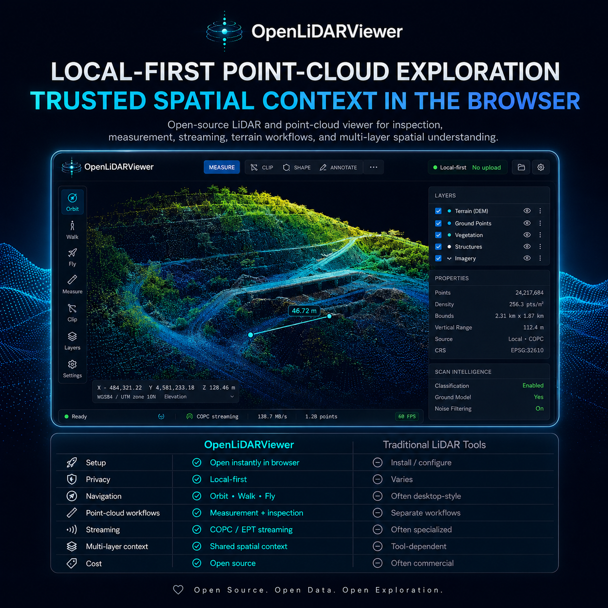
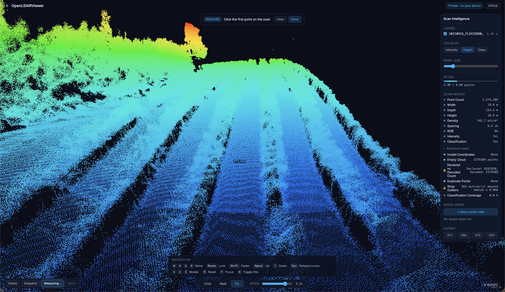
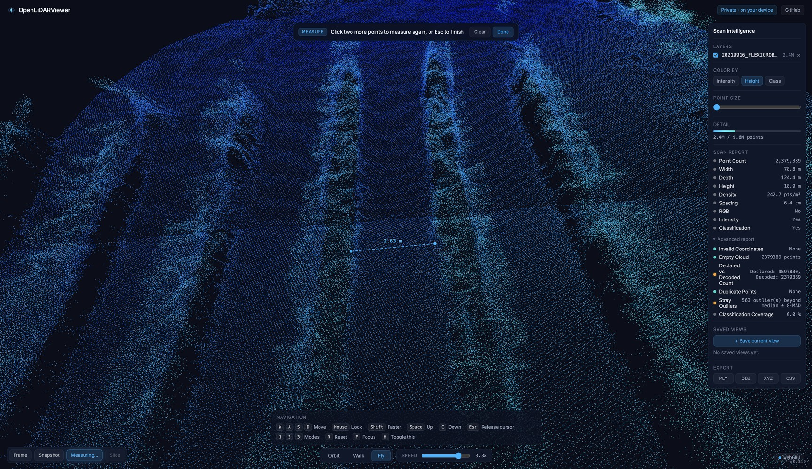
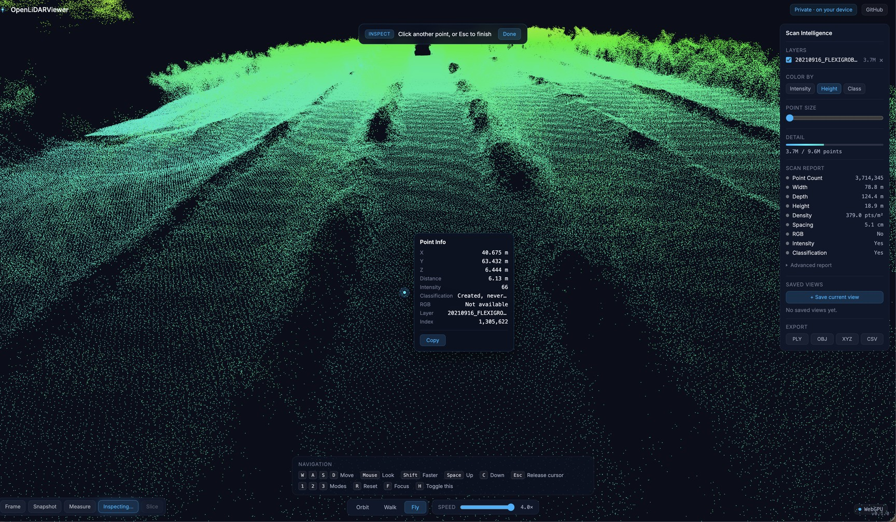
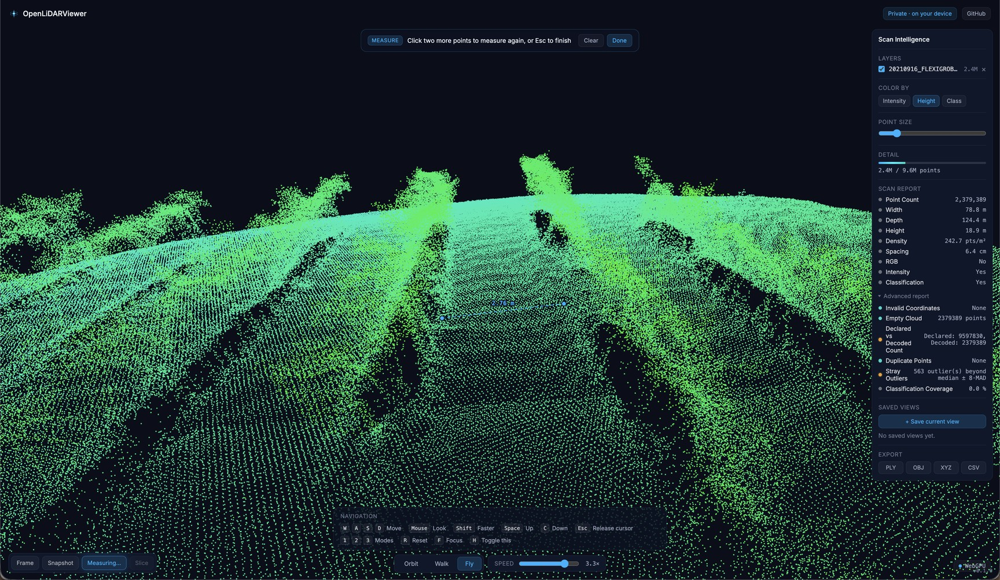

# OpenLiDARViewer

<p align="center"></p>

A browser-native LiDAR and point-cloud viewer for fast local inspection, 3D navigation, measurement, and terrain analysis. Local-first, cited, honest about what it can't tell you.

<!-- Does it build and run, everywhere it claims to -->
[](https://github.com/Aurtechmx/openlidarviewer/actions/workflows/ci.yml)
[](https://github.com/Aurtechmx/openlidarviewer/actions/workflows/clean-clone.yml)
[](https://github.com/Aurtechmx/openlidarviewer/actions/workflows/benchmark-portability.yml)

<!-- Is it measured, and by whom -->
[](https://github.com/Aurtechmx/openlidarviewer/actions/workflows/security.yml)
[](https://codecov.io/gh/Aurtechmx/openlidarviewer)
[](https://dashboard.stryker-mutator.io/reports/github.com/Aurtechmx/openlidarviewer/main)
[](https://sonarcloud.io/summary/new_code?id=Aurtechmx_openlidarviewer)

<!-- Can the work be found and reused -->
[](https://doi.org/10.5281/zenodo.21544619)
[](https://fair-software.eu)
[](https://github.com/Aurtechmx/openlidarviewer/releases/latest)
[](LICENSE)

## Try it in 10 seconds

No install, no account, no upload. Open **[lidar.aurtech.mx](https://lidar.aurtech.mx/)**, then drag a `.las`, `.laz`, or `.copc.laz` file (or paste a remote COPC / `ept.json` URL) onto the page. You're navigating the cloud in your browser, and the file never leaves your device.

New here? The [User Guide](docs/USER_GUIDE.md) walks through opening a scan, measuring, analysing terrain, comparing two scans, and sharing your work. Full documentation, the format matrix, and the scientific validation record live at the [docs site](https://aurtechmx.github.io/openlidarviewer/).

## Overview

OpenLiDARViewer opens LiDAR and point-cloud datasets straight in the browser. You inspect a scan, navigate it in 3D, switch how it is colored, measure distances, run terrain analysis, and export results, without setting up a desktop GIS workflow. Files are read and rendered locally, so there is no server to upload to. Opening a point cloud should feel about as easy as opening an image, while still giving you the spatial depth, navigation, and inspection tools that LiDAR work needs. It is a viewer and inspection tool, not a GIS, photogrammetry, or survey-grade processing suite: every result discloses its coverage, method, and uncertainty, and terrain and contour exports are evidence-gated so they refuse to over-claim.

## Features

- Inspect point-cloud datasets in a modern web interface, with nothing to install and nothing uploaded.
- Open drone LiDAR (LAS, LAZ), terrestrial laser-scanner data (E57, PTX, PTS), iPhone and mobile scan exports (PLY, OBJ, GLB/GLTF, XYZ, CSV), and Point Cloud Library (PCD) files.
- Stream large COPC and EPT datasets progressively, octree node by octree node, with bounded memory and no full-file load.
- Navigate game-style: Orbit, Walk, Fly, and Pan modes with WASD and mouse-look, plus Top / Iso / Oblique / Planar camera presets.
- Measure distance, polyline, area, height, angle, slope, cross-section profile, and volume cut/fill, with editable points and JSON session export/import.
- Run a confidence-aware DTM and contour pipeline: ground classification, gridded DTM with hold-out RMSE, surface models, and evidence-gated contour and DEM export.
- Inspect any point for coordinates, intensity, classification, GPS time, and colour; read a Scan Intelligence panel; annotate findings; compose multi-page PDF reports.
- Switch themes (Dark / Light / High-contrast), drive everything from a command palette (`Cmd-K`), and work one-handed on mobile.

OpenLiDARViewer does not claim survey-grade measurement or support for every LiDAR format. Capabilities are described honestly (see [Limitations](#limitations) and the details below).

<details>
<summary><b>Core viewer</b></summary>

- Browser-based point-cloud visualization, no install
- Local-first scan inspection, nothing is uploaded
- WebGPU rendering with an automatic WebGL 2 fallback
- Import: LAS, LAZ, E57, PLY, OBJ, GLB, GLTF, XYZ, CSV, PCD, PTX, PTS
- Export: LAS (1.2 / 1.4), PLY, OBJ, XYZ, CSV, and PNG snapshots
- Budget-aware fast loading of large LAS/LAZ surveys: header preflight, stride decoding, a memory-safety guard, staged progress, and a load that can be cancelled mid-flight
- Chunked, bounded-memory reading of large text point clouds (XYZ, CSV, PTS); a large survey reduces in density instead of crashing on weak devices
- A universal file-open summary and clear, categorised load-error messages
- A coordinate bridge that keeps large georeferenced (UTM-scale) coordinates numerically stable
</details>

<details>
<summary><b>Streaming</b></summary>

- COPC streaming: a `.copc.laz` file, on disk or hosted at a URL, opens through progressive, octree-based, view-dependent streaming with worker-based decoding and bounded memory, never a full-file load. A remote scan opens from the start screen's open-from-URL field or a shareable `?copc=<url>` deep link
- EPT (Entwine Point Tile) streaming: local and remote, `binary` and `laszip` tiles
- 3D Tiles / `.pnts` (not yet user-facing): a `.pnts` file or a `tileset.json` URL is detected by filename and reported as not-yet-supported rather than opened. There is no tileset parser today, so treat the format as planned, not shipped
- A curated catalog of 12 hand-vetted public COPC / EPT datasets

See [`docs/streaming.md`](docs/streaming.md) and [`docs/copc.md`](docs/copc.md).
</details>

<details>
<summary><b>Navigation & camera</b></summary>

Game-like navigation lets a scan be explored like a 3D environment.

- Orbit, Walk, Fly, and Pan (hand-tool) modes with WASD movement and mouse-look
- Smart camera presets (Top, Iso, Oblique, Planar): one-click jumps that frame the cloud from a known angle
- A triangular nav widget that surfaces the current mode and a centre Reset
- Saved, renamable camera views for repeatable inspection
- Shareable view links: **Copy view link** reproduces the current view (camera, colour mode, point sizing); no scan data is shared, the recipient still needs the same file
- Movement speed scales with the size of the loaded scan, so the controls feel right for a small room or a kilometre-wide survey

| Control | Action |
|---|---|
| W / A / S / D | Move through the scan |
| Mouse | Look around (click the scan to capture the cursor) |
| Shift | Move faster |
| Space | Move up |
| C / Ctrl | Move down |
| Esc | Release the cursor |
| R | Reset / re-frame the view |
| F | Focus on the point under the cursor |
| 1 / 2 / 3 / 4 | Orbit / Walk / Fly / Pan mode |
| G | Toggle the Pan (hand) tool |
| Middle-drag | Pan the view in any mode |
| Double-click | Fly to the clicked point |

Orbit suits inspecting an area from the outside, Pan is the 1:1 hand tool, Walk suits interiors and street-level scans, and Fly suits drone LiDAR, terrain, and wide-area scans. Full detail is in [`docs/navigation.md`](docs/navigation.md).
</details>

<details>
<summary><b>Rendering</b></summary>

Rendering is tuned so a point cloud reads as a 3D surface, not a flat wash of dots.

- Eye Dome Lighting (EDL): screen-space depth shading that darkens depth discontinuities so edges, ridges, and near/far structure become legible. It runs as a post-processing pass targeting both the WebGPU and WebGL 2 backends from one node graph, with strength, radius, and three named presets (Subtle / Balanced / Inspection). On by default on desktop WebGPU, off by default on the WebGL 2 fallback and on mobile, where it can still be switched on
- Hillshade relief overlay from the terrain surface model for topographic readability
- Soft splat rendering: Classic round points, Soft splats, or Inspection mode with density-aware radius
- Adaptive or fixed point sizing, round antialiased points, and a Detail control that shows an honest `shown / total` count
- Height, intensity, classification, RGB, and surface-normal colour modes, picked automatically per file
- Percentile-clipped height mode with a 5/95 default and a Turbo perceptual palette
- HDR sky presets: Studio Dark, Blueprint, Survey Light, Terrain, Black
</details>

<details>
<summary><b>Visuals Studio</b></summary>

- A unified Inspector section with three chip rails (Colour Mode, RGB Preset, Sky / EDL) that re-style the scan without leaving the panel
- RGB appearance presets (Photoreal, Drone RGB, Mobile LiDAR, Infrastructure), each tuning gamma, contrast, saturation, and exposure
- White balance (temperature + tint) with an Auto-balance assist, gated to streaming COPC where it can sample residency
- Patch view at the inspector cursor: a KNN-based tangent-plane projection of the point's neighbourhood with a photometric witness panel
</details>

<details>
<summary><b>Measurement & analysis</b></summary>

Open the Measure tool, pick a kind from the toolbar, and place points directly on the scan. Seven tools are available.

| Tool | What it measures |
|---|---|
| Distance | Straight-line distance between two points |
| Polyline | Total length of a multi-segment path |
| Area | Polygon area, both true in-plane and horizontal (map-projected) |
| Height | Vertical difference between two points |
| Angle | The angle at a vertex between two arms |
| Slope | Rise, run, slope angle, and grade percentage between two points |
| Profile | Cross-section between two points: 3D length, horizontal distance, vertical drop, and grade |

- Every measurement is editable: drag a point, undo the last point while placing, rename, or clear. Placed measurements list in a compact panel and persist for the session. One toggle switches all readouts between metric and imperial. The set exports to a JSON session file and re-imports later
- **Cross-section profile** renders a height-vs-distance chart strip under the row, resizable from a default 140 px out to 360 px so the curve reads at deliverable size
- **Volume (cut / fill)** against a polygon or 3D lasso, with NaN / degenerate / self-intersection guards and a streaming-resident caveat when nodes are still loading
- **Classification editor**: paint a class id over a lassoed selection and write the result back to LAS
- **Density heatmap** overlay for coverage QA, **box clipping / slicing** for interactive cross-cuts, and **measurement chains** that combine placed measurements as sum / difference / ratio
- A **Scan Intelligence** panel with point count, dimensions, density, spacing, attributes, and an Advanced report of integrity diagnostics
- A **Dataset Intelligence** card (header-derived Point Density, Terrain Complexity, Ground Visibility, Streaming Coverage, Terrain Confidence) that leaves a row blank rather than fabricating a bucket when no signal is available
- **Point inspection**: click a point to read its coordinates and attributes (LAS return number, point source ID, GPS time, and UTM + lat/lon when a CRS is known), with one-click copy, or hover with the live probe for a click-free readout
- Capture provenance from LAS/LAZ and E57 headers (sensor, source software, date), shown in the Scan Report when the file carries it

Measurement is meant for visual inspection and research, not survey-grade use. Treat it as survey-grade only if you have validated it against survey-grade data and procedures.
</details>

<details>
<summary><b>Terrain Intelligence & Contour Studio</b></summary>

OpenLiDARViewer ships a terrain analysis stack under `src/terrain/`. Shared type contracts (`TerrainContracts.ts`) give every stage one honesty envelope: a coverage mode (`full` / `resident-only` / `sampled`), the source and analyzed point counts, a 0-100 confidence value, and ordered warnings, so an analyser never implies full-cloud certainty when only resident streaming nodes were walked.

The lightest surface is the Dataset Intelligence card in the Inspector: header-derived, informational, and it does not perform ground classification. The main capability is the confidence-aware DTM and contour pipeline (`src/terrain/contour/`, `ground/`, `surface/`) surfaced through the Analyse panel: ground classification, a gridded DTM with per-cell confidence and hold-out RMSE validation, a 0-100 terrain quality score, surface models (DSM, canopy height, slope, multi-directional hillshade), a single top-level Terrain Assessment verdict, evidence-graded contour export (GeoJSON / SVG / DXF), a printable map sheet, and a georeferenced DEM package (ASCII Grid + GeoTIFF). Ground classification is a heuristic: its output is derived, not survey-grade. A DTM quality gate governs whether terrain-product export is enabled, and per-cell confidence is calibrated against measured hold-out error, not asserted. Treat terrain products and DEM exports as export-ready only when the Terrain Assessment reads Good, and as preview otherwise.

**Contour Studio** is the post-analysis step that turns an analysed scan into a contour deliverable, kept out of the Analyse panel so map-making doesn't crowd the terrain work. You pick a purpose (Engineering Plan, Survey Review, Terrain Research, Presentation Map, or Custom); a purpose only bundles presentation defaults and can never raise a claim. Analytical contours are the exact isolines of the grid, while cartographic contours are generalised for legibility, reference the analytical geometry's hash, and are never labelled exact. Every export routes through one evidence gate that can only downgrade (validated, exploratory, or blocked): a blocked product returns a diagnostic instead of a polished file, an exploratory one is watermarked, and the permit decision is stamped into each artifact's provenance. Exports cover contour vectors (GeoJSON, DXF, SVG), a map-sheet PDF, a DEM raster package, a terrain intelligence report, and a complete ZIP with a SHA256SUMS manifest. Validation is internal hold-out only: nothing is survey-grade, and no output asserts certification.

See [`docs/terrain-intelligence.md`](docs/terrain-intelligence.md), [`docs/validation/terrain-validation-matrix.md`](docs/validation/terrain-validation-matrix.md), and [`docs/contour-studio.md`](docs/contour-studio.md).
</details>

<details>
<summary><b>Annotation, sessions & reporting</b></summary>

- Annotations: drop categorised, titled markers with notes, browse and search them, capture the camera viewpoint with each, and undo/redo. The panel and the PDF report open with a grouping summary (totals, per-category counts, and how many areas the notes fall across)
- Inspection sessions: export measurements, annotations, and named views to one JSON file and reload them later
- Workflow recorder: record and replay `.olvworkflow` files of camera moves and tool actions, with settings for file format, save destination, start/stop shortcut, replay speed, a pre-record countdown, captured action families, and loop replay. It records actions only, never scan data, so a recipient needs the same scan open to replay
- Multi-page PDF technical reports: two built-in templates (Survey Summary, Technical Report) with branding and unit-system awareness
- Visual Export Studio: orthographic RGB, height map, intensity, classification, depth, normal, and contour map exports
- Screenshot export that burns in placed measurements and annotations as inspection evidence
</details>

<details>
<summary><b>Interface & accessibility</b></summary>

- Theme system (Dark, Light, High-contrast) with a persisted preference
- A colourblind-safe (Okabe-Ito) classification palette, toggled from the Classes panel, so ground, vegetation, buildings, and water stay distinguishable under the common colour-vision deficiencies
- Command palette (`Cmd-K` / `Ctrl-K`) for keyboard-first access to every tool, mode, theme, and export
- Searchable shortcut sheet (`?`) listing every keybinding, plus a built-in help overlay
- An onboarding tour through the empty state, tool dock, and Inspector
- A mobile touch model with twist + pinch + pan decomposition, sub-threshold dead zones to stop accidental wobble, and an opt-in 3-finger zoom
- A mobile Scan Intelligence bottom-sheet with peek + tap-to-toggle, and an overflow "More" disclosure on the tool dock so the primary row stays one-handed
</details>

<details>
<summary><b>Multi-scan & embed</b></summary>

- Open multiple scans as layers, or close the current scan from the tool dock to start fresh with another
- An embed mode for `<iframe>` use (`?embed=1`), with a validated `postMessage` bridge for host-page control
- Developer diagnostics: a live performance overlay (`?debug=1`) and a structured benchmark mode (`?benchmark=1`)
</details>

## Screenshots

| | |
|---|---|
|  |  |
| A 9.6M-point drone survey, height-colored, with the Scan Intelligence panel and Orbit / Walk / Fly navigation. | The measurement toolkit: here a distance between two picked points. |
|  |  |
| Inspecting a point: a glowing marker and a card with its real-world coordinates and attributes. | The Scan Intelligence panel: point count, dimensions, density, spacing, attributes, and the Advanced report. |

More in [`docs/screenshots.md`](docs/screenshots.md).

## Formats & requirements

**Import:** `LAS`, `LAZ`, `E57`, `PLY`, `OBJ`, `GLB`, `GLTF`, `XYZ`, `CSV`, `PCD`, `PTX`, `PTS`.
**Export:** `LAS` (1.2 / 1.4), `PLY`, `OBJ`, `XYZ`, `CSV`, and `PNG` snapshots.

For large datasets, stream **COPC** (`.copc.laz`) or **EPT** (`ept.json`), which load progressively with bounded memory. For lightweight sharing, use **PLY** or **GLB**.

<details>
<summary><b>Format matrix and compatibility notes</b></summary>

That covers iPhone and mobile scan exports (PLY, OBJ, GLB/GLTF; `USDZ` needs conversion first), terrestrial laser-scanner data in E57 (ASTM E2807, tested against Trimble exports) plus PTX and PTS, georeferenced drone LiDAR in LAS/LAZ, and PCD in all three encodings (ASCII, binary, binary-compressed). Large COPC and EPT datasets stream progressively, locally or over HTTP range requests from a URL, with bounded memory and no full-file load.

Format support varies with browser memory, GPU capacity, dataset size, preprocessing, and implementation status. The per-format detail, including scanner and app compatibility, is the format matrix at the [docs site](https://aurtechmx.github.io/openlidarviewer/formats/) (source: [`docs/supported-formats.md`](docs/supported-formats.md)).
</details>

<details>
<summary><b>System requirements</b></summary>

OpenLiDARViewer runs in the browser and depends on modern GPU-accelerated web rendering. Performance varies with the dataset and the device. Use a modern Chromium-based browser (Chrome or Edge) with WebGL 2.0 support and hardware acceleration enabled. WebGPU is used automatically where it is available. Firefox and Safari are supported (a WebGL fallback may apply).

| Component | Minimum | Recommended |
|---|---|---|
| CPU | Modern dual-core | Quad-core or better |
| RAM | 8 GB | 16 GB or more |
| GPU | Integrated GPU with WebGL 2.0 | Dedicated GPU, or modern Apple Silicon / integrated GPU |
| Browser | WebGL 2.0 compatible | WebGL 2.0 and WebGPU-capable |

Very large datasets are best handled as COPC or EPT; other very large formats may need downsampling or preprocessing. See [`docs/copc.md`](docs/copc.md) and [`docs/performance.md`](docs/performance.md).
</details>

<details>
<summary><b>Mobile browser support</b></summary>

OpenLiDARViewer includes a mobile-friendly interface for opening compatible point-cloud and 3D scan files from phones and tablets. On mobile: files open from the device file picker or a cloud file provider, Scan Intelligence shows as a compact panel, navigation uses touch gestures, measurement uses tap-based point selection, and rendering defaults to a mobile-safe performance mode.

Recommended workflow: export a compatible scan from a mobile scanning app, save it to device storage or a cloud provider (such as iCloud Drive), open OpenLiDARViewer in a mobile browser, tap "Open scan from device," then inspect, measure, and export. A practical test is to capture with an iPhone LiDAR app (Polycam, Scaniverse, 3D Scanner App), export in a supported format (GLTF/GLB, OBJ, or PLY), and open it. Export formats, free-tier options, and pricing differ between apps and can change, so check each app's current help. Some formats may require a paid plan.

Mobile performance depends on browser, GPU, memory, file size, and point count; very large datasets may require desktop hardware, downsampling, tiling, or optimized formats. All third-party product names are used only for descriptive compatibility. OpenLiDARViewer is not affiliated with, endorsed by, or sponsored by Apple, Polycam, or other third-party scanning apps. Full detail is in [`docs/mobile-browser-support.md`](docs/mobile-browser-support.md).
</details>

## Getting started

```bash
git clone https://github.com/Aurtechmx/openlidarviewer.git
cd openlidarviewer
npm install
npm run dev
```

Open the local URL it prints, then drop a scan onto the page or click a built-in sample. To build for static hosting (GitHub Pages, Netlify, or any CDN, since it is just files):

```bash
npm run build
npm run preview
```

<details>
<summary><b>Using the viewer</b></summary>

1. Open the app in a modern WebGL/WebGPU-capable browser.
2. Drop a compatible point-cloud file onto the page.
3. Choose a visual mode: Height, Intensity, Classification, RGB, or Normal.
4. Adjust point size and rendering detail.
5. Navigate with Orbit, Walk, or Fly mode.
6. Read the Scan Intelligence panel for dataset metadata and quality.
7. Measure distance, polyline, area, height, angle, slope, or cross-section profile inside the point cloud.
8. Annotate points of interest with categorised notes, and inspect or probe individual points.
9. Save viewpoints for repeated inspection.
10. Export a PNG snapshot, re-export the cloud as PLY, OBJ, XYZ, or CSV, or save the full working state as a `.olvsession` package.
11. Close the scan from the tool dock to return to the start and open another.

A fuller walkthrough is in [`docs/usage.md`](docs/usage.md).
</details>

<details>
<summary><b>Recommended workflows</b></summary>

Each assumes a single drag-and-drop or URL open, with everything happening locally in the browser.

- **Large streaming dataset review.** Open COPC (`.copc.laz`) or EPT (`ept.json`), local file or remote URL. Navigate at interactive frame rates against datasets far larger than browser memory; the scheduler streams only what the current view needs.
- **Inspection reporting.** Annotate findings, measure distances / areas / slopes / angles / profiles, then export a multi-page PDF report (cover, dataset summary, embedded image exports, annotations, measurements, technical notes). Two templates and brand-aware accent + logo support.
- **Terrain analysis.** Export height maps from drone LiDAR with legend customisation and unit-system control, useful for slope review, elevation comparison, and quick topographic figures. Cross-section profiles report 3D length, horizontal distance, vertical drop, and grade across any two picked points.
- **Classification QA.** Export classification maps, toggle the colour mode to highlight specific classes, place annotations on misclassified regions, and round-trip the working state through `.olvsession`.
- **Mobile scan review.** Open lightweight datasets (`.glb`, `.ply`, `.obj` from Polycam, Scaniverse, or similar) on tablets or phones. The viewer adapts rendering detail and EDL defaults for weaker GPUs so a phone scan is readable from the first frame.
</details>

## Under the hood

<details>
<summary><b>How it works</b></summary>

1. You load a dataset by dropping a file, or by clicking a built-in sample.
2. The format is detected from the file's magic bytes first, then its extension.
3. The file is parsed off the main thread, inside a Web Worker.
4. Point positions and attributes are decoded. Large georeferenced coordinates are recentered in double precision before the float32 downcast.
5. Clouds above the point budget are voxel-downsampled, and the Detail control shows the honest `shown / total` count.
6. The cloud renders through a WebGPU or WebGL 2 pipeline built on three.js; Eye Dome Lighting adds screen-space depth shading as a post-processing pass.
7. Color modes map height, intensity, classification, RGB, or surface-normal direction onto the points, sized adaptively with distance.
8. You explore with Orbit, Walk, or Fly navigation.
9. Scan Intelligence summarizes the dataset, and the measurement toolkit takes its measurements.
10. You save viewpoints and export snapshots, re-exported point data, or a JSON measurement session.
</details>

<details>
<summary><b>Technology stack</b></summary>

- TypeScript in strict mode, across the IO, model, and render layers
- three.js (`three/webgpu`), a WebGPU renderer with a WebGL 2 fallback
- A `three/tsl` node-graph post-processing pipeline (Eye Dome Lighting) that targets both backends from one shader description
- loaders.gl and laz-perf (WASM) for mesh and LAZ parsing, plus a from-scratch TypeScript E57 parser
- Vite for the build and dev server, with Web Worker and WASM handling
- Vitest and Playwright for unit and end-to-end tests
- A client-side, local-first pipeline with no backend
</details>

<details>
<summary><b>Architecture</b></summary>

OpenLiDARViewer is modular, with one file per format and one file per concern. File loading, point parsing, the coordinate bridge, render-buffer generation, color modes, the navigation manager, the measurement system, the Scan Intelligence modules, and the export system are all separable. See [`docs/architecture.md`](docs/architecture.md) and the [Developer Manual](docs/developer-manual.md).
</details>

<details>
<summary><b>Performance notes</b></summary>

Performance depends on point count, browser memory, GPU capability, point size, rendering detail, the color mode, the file format, and how the data was prepared. A LAS/LAZ file is planned from its header before it is fully read: a cloud above the roughly 4M-point budget loads at reduced density (voxel-downsampled, or stride-decoded when far over budget so it is never fully decoded into memory; the source file is still read in once, while COPC/EPT are the true streaming paths), with a memory-safety guard, staged progress, and a cancellable load. The Detail readout always shows the honest `shown / total` count.

COPC streaming (local and remote) ships in v0.3.0 and is hardened across v0.3.1 / v0.3.3 with a view-dependent scheduler, hierarchy-aware eviction, a dispatch-pressure gate that bounds residency under 1B-synthetic-point stress, and trustworthy picking against actively-refining clouds. EPT joins COPC as a first-class peer in v0.3.3.

For real-world figures (a 9.6M-point drone LAZ survey and a 55K-point iPhone scan, both from one drag-and-drop) see [`docs/benchmarks.md`](docs/benchmarks.md), [`docs/performance.md`](docs/performance.md), and [`docs/streaming.md`](docs/streaming.md).
</details>

## Limitations

OpenLiDARViewer is an actively maintained project focused on lightweight visualization and interaction. It is not meant to replace full GIS, photogrammetry, or survey-grade processing tools. It leaves CRS reprojection to dedicated tools and analyses each scan in its own frame.

- Large files are limited by browser memory and GPU performance; some formats need preprocessing or conversion before they load, and format support is still evolving.
- Measurement is for visual inspection, not survey-grade use.
- Metric figures fail closed when the CRS linear unit is unconfirmed: the viewer reports extents in the source unit rather than fabricating metres.
- Coordinate reference system handling is basic; there is no cross-CRS reprojection.
- Classification visualization depends on attributes present in the file.
- Very large datasets stream as COPC (local or remote); other huge formats may still need tiling or downsampling.
- WebGPU feature support varies by browser, with the WebGL 2 fallback used otherwise. Eye Dome Lighting is a screen-space depth cue, not physically-based lighting, and is off by default on the WebGL 2 fallback and on mobile.

Full detail is in [`docs/limitations.md`](docs/limitations.md).

## FAQ

**Can I view LAS / LAZ / COPC files in the browser?**
Yes. Drag a `.las`, `.laz`, or `.copc.laz` onto [lidar.aurtech.mx](https://lidar.aurtech.mx/), or paste a remote COPC / `ept.json` URL. No install, no plugin.

**Is my data uploaded anywhere?**
No. Files are read and rendered locally. The only network calls are for remote datasets you choose to open; your local files never leave your device.

**What's the largest scan it can open?**
Local files are bounded by browser memory and GPU. For very large datasets, stream them as COPC (local or remote) or convert with PDAL / Entwine; streaming only loads the resident set the camera needs.

**Which formats are supported?**
LAS / LAZ, PLY, XYZ / CSV, E57, and glTF / GLB for static loads; COPC and EPT for streaming. See [Formats & requirements](#formats--requirements).

**Is it survey-grade?**
No. Measurements and quality grades describe the data you loaded; they are not a survey-grade certification. Validate against ground control where accuracy matters.

**Does it need WebGPU?**
No. WebGPU is the primary path and it falls back to WebGL 2 automatically.

## Project & research

OpenLiDARViewer started as an experiment: how far can modern browser technology go in making LiDAR and point-cloud data easy to reach? It explores browser-native rendering, lightweight WebGL/WebGPU pipelines, human-centered interaction with 3D data, game-inspired navigation for technical inspection, and local-first workflows. The aim is not to replace full GIS or survey-grade processing, but to give people a fast, approachable way to open, inspect, navigate, measure, and present point clouds. See [`docs/research-notes.md`](docs/research-notes.md).

The current release is **v0.6.5**. The dated history is in [CHANGELOG.md](CHANGELOG.md), and per-release highlights live in the [Releases section of the docs site](https://aurtechmx.github.io/openlidarviewer/releases/).

### Help test OpenLiDARViewer

OpenLiDARViewer improves through feedback from people who work with point clouds day to day: GIS, drone mapping, terrain analysis, hydrology, surveying, web mapping. Open a workflow you already know, on the live demo or a local build. Use one of your own authorised files, compare the values you care about against ArcGIS, CloudCompare, PDAL, or whatever you normally trust, and say what worked, what failed, and what was unclear.

The quick report takes five to ten minutes. A longer comparison against a reference tool (metadata, CRS, units, elevations, measurements, terrain products) is optional. Participation is voluntary and unpaid. Please do not submit confidential, restricted, or personal information, and do not send source datasets you are not free to redistribute. A failed file, an unexpected warning, or one confusing screenshot is worth sending; negative results are the useful kind here. Email what you found to <info@aurtech.mx>.

## Validation & reproducibility

For reviewers, and anyone who wants to check the claims above rather than take them on trust:

- [REVIEWER_QUICKSTART.md](REVIEWER_QUICKSTART.md): install and run the offline test suite from a clean clone in about two minutes.
- [VALIDATION_REPORT_v0.6.5.md](docs/releases/VALIDATION_REPORT_v0.6.5.md): what this release validates and what it does not; the terrain and measurement algorithms are inherited from [VALIDATION_REPORT_v0.5.9.md](docs/releases/VALIDATION_REPORT_v0.5.9.md), while the building ground-support gate carries new synthetic evidence.
- [KNOWN_LIMITATIONS_v0.6.5.md](docs/releases/KNOWN_LIMITATIONS_v0.6.5.md): the documented limits of this release (building gate evaluated on synthetic scenes only, multi-layer mounting disabled, residual streaming flicker, no cross-CRS reprojection).
- [REPRODUCIBILITY.md](REPRODUCIBILITY.md): the pinned toolchain and the steps to reproduce the build, tests, and reported figures.
- [ARTIFACT_EVALUATION.md](ARTIFACT_EVALUATION.md): how to evaluate the artifact without special hardware or private data.
- [DATA_AVAILABILITY.md](DATA_AVAILABILITY.md): where the test fixtures and streamed sample datasets come from, and how they are licensed.

## Contributing

Contributions are welcome. See [CONTRIBUTING.md](.github/CONTRIBUTING.md), the [security policy](.github/SECURITY.md), and the [code of conduct](.github/CODE_OF_CONDUCT.md). The codebase is small, test-first (Vitest and Playwright), written in strict TypeScript, and modular.

## Acknowledgements

OpenLiDARViewer stands on a lot of open work, and we're grateful for it.

**Built on** [three.js](https://github.com/mrdoob/three.js) (rendering), [loaders.gl](https://github.com/visgl/loaders.gl) (format parsing), [proj4js](https://github.com/proj4js/proj4js) (CRS transforms), [pdf-lib](https://github.com/Hopding/pdf-lib) (reports), and [laz-perf](https://github.com/hobuinc/laz-perf) (LAZ decoding). Full licenses in [THIRD_PARTY_NOTICES.md](docs/project/THIRD_PARTY_NOTICES.md).

**Data:** the streamed sample datasets are limited to sources with a confirmed open licence: [USGS 3DEP](https://www.usgs.gov/3d-elevation-program) (public domain) and the swisstopo and GURS national programmes (via FLAI). Providers and terms are listed in [docs/credits.md](docs/credits.md).

**Standards & formats:** ASPRS (LAS/LAZ), the Khronos Group (glTF/GLB), ASTM (E57), and OGC / IOGP-EPSG (coordinate systems). Particular thanks to **Howard Butler** and **Hobu, Inc.**, whose work on laz-perf, COPC, and Entwine this viewer relies on.

## License

MIT. See [LICENSE](LICENSE). If you use OpenLiDARViewer in research, a [CITATION.cff](CITATION.cff) is included. Developed by Aurtech ([aurtech.mx](https://aurtech.mx)).
</content>
</invoke>
