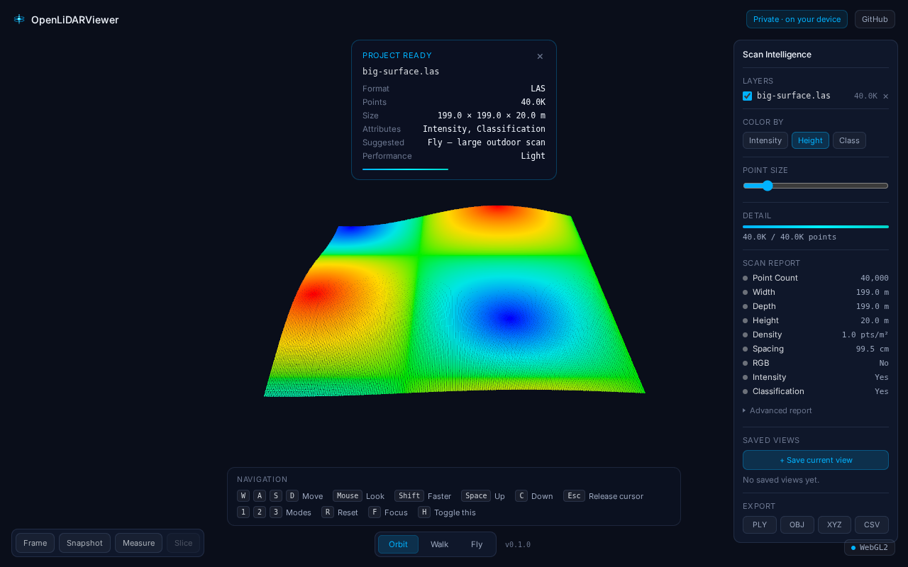
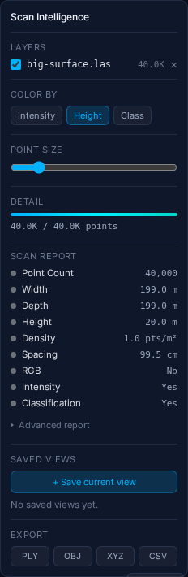
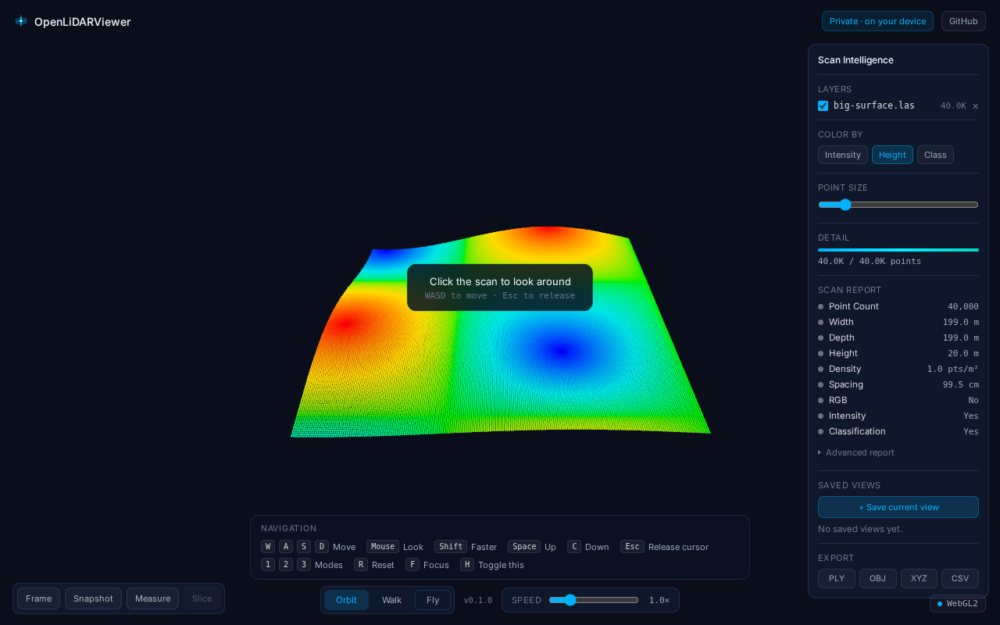
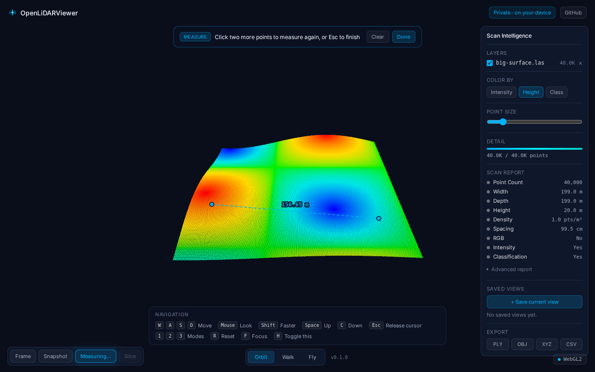

# Screenshots

Reference screenshots used in the README and documentation. The files live in `docs/screenshots/`.

## openlidarviewer-main.png

OpenLiDARViewer showing a large point-cloud dataset with height-based coloring, the Scan Intelligence panel, the "Project ready" summary card, and the Orbit / Walk / Fly navigation modes.

## scan-intelligence-panel.png

The Scan Intelligence panel: point count, dimensions, density, spacing, detected attributes, rendering controls, an Advanced report of integrity diagnostics, saved views, and export actions.

## navigation-modes.png

Game-like navigation, with a controls HUD and the Orbit / Walk / Fly modes for point-cloud exploration.

## measurement-tool.png

The measurement workflow: selecting two points and reading the straight-line distance inside the point cloud.

## Notes

Screenshots are captured from the running app at 1280x800. Re-capture them after significant UI changes so the documentation stays accurate.
