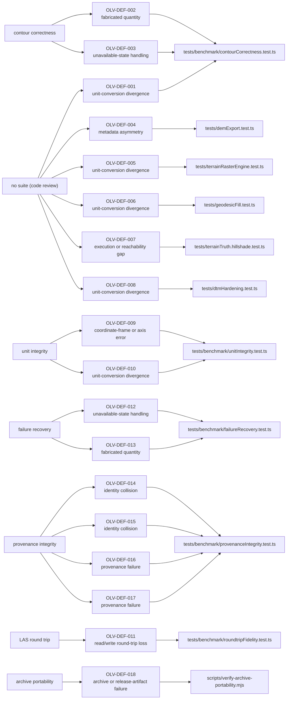

# Defect summary

Generated by `scripts/build-defect-summary.mjs` from
`validation/defects/defect-registry.json`. Do not edit this file; edit the
registry and re-run the script. Every number below is a count over the
registry records, and one record per CHANGELOG 0.6.2 Fixed entry. Where an entry bundles more than one distinct fault, the faults are listed in bundledFaults and the record count still follows the changelog.

Records: 18. Registry version 0.6.2.

## Detection

| detecting mechanism | defects |
| --- | --- |
| none | 6 |
| suite-5-provenance-integrity | 4 |
| suite-2-unit-integrity | 2 |
| suite-4-failure-recovery | 2 |
| suite-6-contour-correctness | 2 |
| suite-7-las-round-trip | 1 |
| suite-8-archive-portability | 1 |

| discovery method | defects |
| --- | --- |
| validation suite | 12 |
| code review | 6 |

Detected by a validation suite: 12 of 18. Discovered without one: 6 of 18. The
second group came from reading the code, and `scripts/check-defect-registry.mjs`
refuses a record whose `discoveryMethod` and `detectingMechanism` disagree, so
the two figures cannot drift apart.

## The suite that already existed

The test suite as it stood at tag v0.6.1: every file under tests/ at that tag, run by vitest with no environment gating.

Established by: git worktree at v0.6.1 with node_modules from the working tree, then `npx vitest run`.
Result: exit 0; 507 test files passed, 2 skipped; 6182 tests passed, 16 skipped, measured 2026-07-27.

| state on the defective code | defects |
| --- | --- |
| green | 17 |
| mixed | 1 |

A `green` value on a record means this run passed while the defective code was present in that tree. It is not evidence that any test in that run exercised the defect.

All 18 records were missed by the tests that already existed, which is what
placed them in this registry. 1 had no pre-existing test file referencing the
affected module at all.

## Taxonomy

| primary validation category | defects |
| --- | --- |
| unit-conversion divergence | 5 |
| fabricated quantity | 2 |
| identity collision | 2 |
| provenance failure | 2 |
| unavailable-state handling | 2 |
| archive or release-artifact failure | 1 |
| coordinate-frame or axis error | 1 |
| execution or reachability gap | 1 |
| metadata asymmetry | 1 |
| read/write round-trip loss | 1 |

Counted over the primary category and the secondary tags together, once per record:

| failure mechanism | defects |
| --- | --- |
| unit-conversion divergence | 9 |
| provenance failure | 4 |
| unavailable-state handling | 3 |
| coordinate-frame or axis error | 2 |
| fabricated quantity | 2 |
| identity collision | 2 |
| metadata asymmetry | 2 |
| archive or release-artifact failure | 1 |
| read/write round-trip loss | 1 |
| unsupported claim or wording | 1 |

| detection gap | defects |
| --- | --- |
| execution or reachability gap | 2 |
| verification blind spot | 2 |
| environment mismatch | 1 |
| oracle gap | 1 |

Records carrying at least one secondary tag: 13 of 18. A record needs one when a
single term does not cover it, most often because a unit or frame fault sat
behind a check that could not reach it.

## Severity

| severity | defects |
| --- | --- |
| high | 9 |
| medium | 7 |
| low | 2 |

- high: A wrong measured quantity, or a broken identity, reaches output on a path the shipped pipeline uses.
- medium: Metadata or a declaration is wrong or missing, or a wrong quantity sits on a path the shipped pipeline does not use today.
- low: No measured quantity and no metadata is wrong in application output; the fault is in dead code or in a release artifact.

Records with a measured magnitude: 15. Without one: 3, recorded as null rather than as zero.

## Oracle required

| oracle type | defects |
| --- | --- |
| archive extract contract, checked from inside the extract | 1 |
| cross-backend equivalence with a non-unit factor | 1 |
| cross-path invariance between the streaming and static refreshers | 1 |
| cross-path invariance between two exporters of one raster | 1 |
| cross-path invariance between two report renderers of one scan | 1 |
| cross-surface consistency for one run | 1 |
| dimensional consistency of a cost function, per axis | 1 |
| dimensional consistency of a threshold against the quantity it bounds | 1 |
| explicit-unavailable contract | 1 |
| explicit-unavailable contract under degenerate input, with a healthy control | 1 |
| explicit-unavailable contract under fault injection | 1 |
| independent decoder plus write-then-read round trip | 1 |
| injectivity of a content hash, plus bidirectional listing-to-tree comparison and re-derivation | 1 |
| injectivity of an identifier over distinct inputs | 1 |
| reachability of the code the tests exercise | 1 |
| self-consistency of a declaration against the artifact it describes | 1 |
| self-description read back through the real header parser | 1 |
| specification text (RFC 7946 section 3.1.1) | 1 |

## Where the fixes landed

| pull request | defects |
| --- | --- |
| PR #47 | 5 |
| PR #60 | 4 |
| PR #57 | 2 |
| PR #59 | 2 |
| PR #61 | 2 |
| PR #62 | 1 |
| PR #63 | 1 |
| PR #68 | 1 |

## Defect to evidence

Left to right: what exposed the record, the record, and the test that holds it
fixed. The left column is the `detectingMechanism` field, so a record found by
reading the code enters the diagram from the "no suite" node rather than from a
suite. The right column is the `regressionTest.file` field verbatim. Records
sharing a test file converge on one node, which is why some nodes carry several
edges. Nothing in the diagram is weighted, ordered by importance, or scaled by
severity; it is an adjacency drawing of two registry fields, regenerated with
the rest of this file.

## Index

| id | severity | category | detected by | regression test |
| --- | --- | --- | --- | --- |
| OLV-DEF-001 | medium | unit-conversion divergence | no suite (code review) | `tests/benchmark/contourCorrectness.test.ts` |
| OLV-DEF-002 | medium | fabricated quantity | contour correctness | `tests/benchmark/contourCorrectness.test.ts` |
| OLV-DEF-003 | medium | unavailable-state handling | contour correctness | `tests/benchmark/contourCorrectness.test.ts` |
| OLV-DEF-004 | medium | metadata asymmetry | no suite (code review) | `tests/demExport.test.ts` |
| OLV-DEF-005 | medium | unit-conversion divergence | no suite (code review) | `tests/terrainRasterEngine.test.ts` |
| OLV-DEF-006 | high | unit-conversion divergence | no suite (code review) | `tests/geodesicFill.test.ts` |
| OLV-DEF-007 | low | execution or reachability gap | no suite (code review) | `tests/terrainTruth.hillshade.test.ts` |
| OLV-DEF-008 | high | unit-conversion divergence | no suite (code review) | `tests/dtmHardening.test.ts` |
| OLV-DEF-009 | high | coordinate-frame or axis error | unit integrity | `tests/benchmark/unitIntegrity.test.ts` |
| OLV-DEF-010 | high | unit-conversion divergence | unit integrity | `tests/benchmark/unitIntegrity.test.ts` |
| OLV-DEF-011 | high | read/write round-trip loss | LAS round trip | `tests/benchmark/roundtripFidelity.test.ts` |
| OLV-DEF-012 | high | unavailable-state handling | failure recovery | `tests/benchmark/failureRecovery.test.ts` |
| OLV-DEF-013 | high | fabricated quantity | failure recovery | `tests/benchmark/failureRecovery.test.ts` |
| OLV-DEF-014 | high | identity collision | provenance integrity | `tests/benchmark/provenanceIntegrity.test.ts` |
| OLV-DEF-015 | high | identity collision | provenance integrity | `tests/benchmark/provenanceIntegrity.test.ts` |
| OLV-DEF-016 | medium | provenance failure | provenance integrity | `tests/benchmark/provenanceIntegrity.test.ts` |
| OLV-DEF-017 | medium | provenance failure | provenance integrity | `tests/benchmark/provenanceIntegrity.test.ts` |
| OLV-DEF-018 | low | archive or release-artifact failure | archive portability | `scripts/verify-archive-portability.mjs` |
